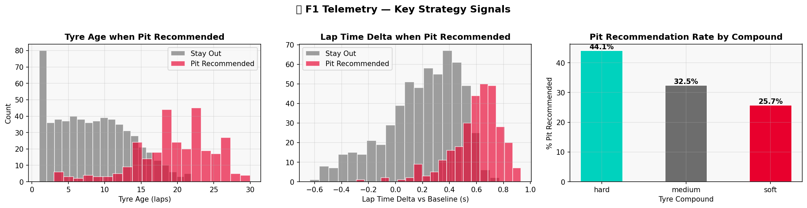
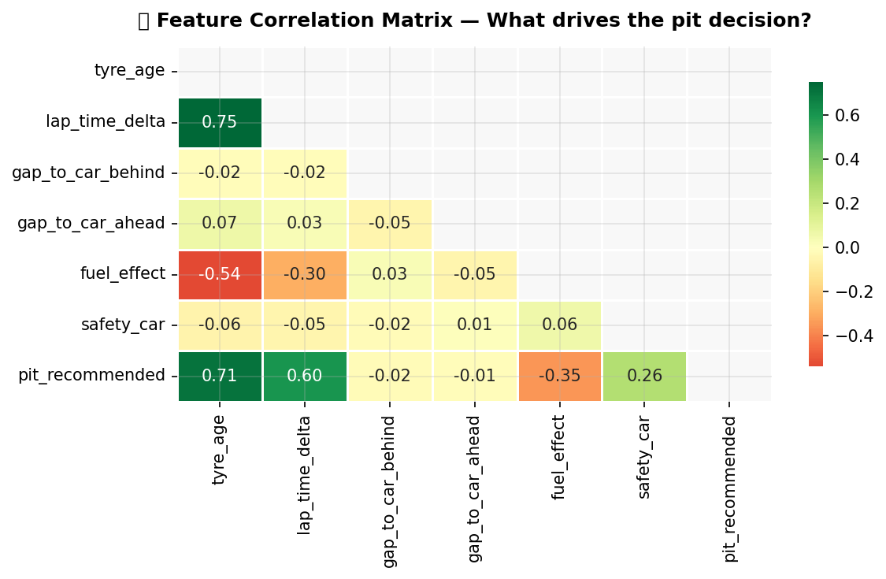
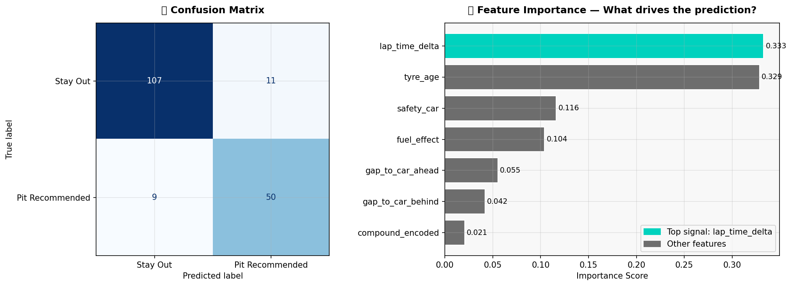
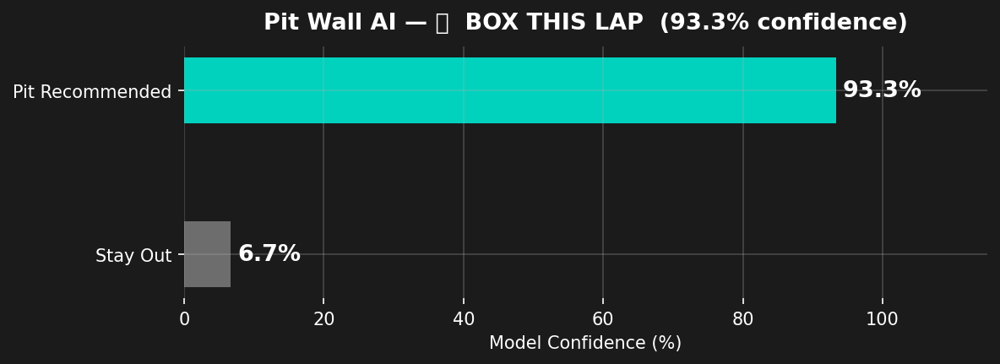

# F1 Pit Lane Engineer Agent with ML and LangGraph

An F1 strategy demo that predicts whether a driver should pit based on race telemetry, then wraps that prediction in an agent-style pit wall experience.

This repo is organized as a two-part workflow:

1. `lights_out_demo.ipynb` explores the dataset, visualizes strategy signals, and trains a pit stop recommendation model.
2. `agent_pitstop.ipynb` turns that model into a pit wall assistant that can use a local model or an Azure ML endpoint, plus an LLM backend for strategy-style responses.

## What the project does

- Trains a `RandomForestClassifier` on F1-style telemetry
- Predicts `pit_recommended` from race-state features
- Saves a reusable local model in [`model/pit_model.pkl`](/c:/Users/boatc/OneDrive/Desktop/f1-lightsout/model/pit_model.pkl)
- Includes a scoring script in [`model/score.py`](/c:/Users/boatc/OneDrive/Desktop/f1-lightsout/model/score.py) for Azure ML deployment
- Demonstrates an agent that combines model output with race context

## Dataset and features

The training data lives in [`f1_telemetry.csv`](/c:/Users/boatc/OneDrive/Desktop/f1-lightsout/f1_telemetry.csv).

The model uses these inputs:

- `tyre_age`
- `lap_time_delta`
- `compound_encoded` from `tyre_compound`
- `gap_to_car_behind`
- `gap_to_car_ahead`
- `fuel_effect`
- `safety_car`

The target is `pit_recommended` where:

- `1` = pit this lap
- `0` = stay out

## Repository contents

- [`lights_out_demo.ipynb`](/c:/Users/boatc/OneDrive/Desktop/f1-lightsout/lights_out_demo.ipynb): EDA, feature prep, model training, evaluation, and sample decisions
- [`agent_pitstop.ipynb`](/c:/Users/boatc/OneDrive/Desktop/f1-lightsout/agent_pitstop.ipynb): pit wall agent demo using tool calls
- [`deploy_model.py`](/c:/Users/boatc/OneDrive/Desktop/f1-lightsout/deploy_model.py): trains the model, saves artifacts, and scaffolds Azure ML deployment
- [`model/score.py`](/c:/Users/boatc/OneDrive/Desktop/f1-lightsout/model/score.py): scoring entrypoint for endpoint inference
- [`model/pit_model.pkl`](/c:/Users/boatc/OneDrive/Desktop/f1-lightsout/model/pit_model.pkl): trained classifier artifact
- [`model/label_encoder.pkl`](/c:/Users/boatc/OneDrive/Desktop/f1-lightsout/model/label_encoder.pkl): encoder for tyre compound values

Generated visuals:

- [`eda_signals.png`](/c:/Users/boatc/OneDrive/Desktop/f1-lightsout/eda_signals.png)
- [`correlation_matrix.png`](/c:/Users/boatc/OneDrive/Desktop/f1-lightsout/correlation_matrix.png)
- [`model_results.png`](/c:/Users/boatc/OneDrive/Desktop/f1-lightsout/model_results.png)
- [`pit_decision.png`](/c:/Users/boatc/OneDrive/Desktop/f1-lightsout/pit_decision.png)

## Quick start

### 1. Create an environment

```powershell
python -m venv .venv
.venv\Scripts\Activate.ps1
```

### 2. Install dependencies

There is no pinned `requirements.txt` in this repo yet, so install the packages used by the notebooks and deployment script:

```powershell
pip install jupyter pandas numpy matplotlib seaborn scikit-learn joblib python-dotenv requests openai azure-ai-ml azure-identity
```

### 3. Launch Jupyter

```powershell
jupyter notebook
```

### 4. Run the notebooks

Recommended order:

1. Open [`lights_out_demo.ipynb`](/c:/Users/boatc/OneDrive/Desktop/f1-lightsout/lights_out_demo.ipynb)
2. Run all cells to explore the data, train the model, and generate charts
3. Open [`agent_pitstop.ipynb`](/c:/Users/boatc/OneDrive/Desktop/f1-lightsout/agent_pitstop.ipynb)
4. Run all cells to start the pit wall assistant demo

## Running locally without Azure

This is the easiest path and works with the files already in the repo.

### Local prediction mode

`agent_pitstop.ipynb` automatically falls back to the local model if Azure ML endpoint variables are not set.

It loads:

- [`model/pit_model.pkl`](/c:/Users/boatc/OneDrive/Desktop/f1-lightsout/model/pit_model.pkl)

### LLM backend options

The agent notebook supports:

- Azure OpenAI / Foundry, if Azure variables are configured
- OpenAI, if `OPENAI_API_KEY` is set

If you only want the ML part of the demo, you can still run the training notebook and inspect the prediction examples without deploying anything.

## Optional Azure setup

### Azure ML endpoint

[`deploy_model.py`](/c:/Users/boatc/OneDrive/Desktop/f1-lightsout/deploy_model.py) can:

- retrain the model from `f1_telemetry.csv`
- save the model artifacts
- create the scoring script
- provide a scaffold for registering and deploying the model in Azure ML

Environment variables used by the deployment script:

```env
AZURE_SUBSCRIPTION_ID=
AZURE_RESOURCE_GROUP=
AZURE_ML_WORKSPACE=
```

Once deployed, the agent notebook can use:

```env
AZURE_ML_ENDPOINT_URL=
AZURE_ML_ENDPOINT_KEY=
```

### Azure OpenAI / Foundry

The agent notebook also supports Azure-hosted LLM calls with:

```env
AZURE_OPENAI_ENDPOINT=
AZURE_OPENAI_API_KEY=
AZURE_OPENAI_DEPLOYMENT=
AZURE_OPENAI_API_VERSION=2024-10-21
```

If those values are missing, the notebook falls back to the standard OpenAI client when `OPENAI_API_KEY` is available.

## Example workflow

1. Train or reuse the local pit model
2. Feed a live race scenario into the prediction tool
3. Combine the prediction with race conditions such as gaps, safety car state, or weather context
4. Return a pit wall style recommendation with confidence and suggested compound

## Screenshots

### Strategy signals



### Correlation view



### Model performance



### Sample pit wall decision



## Notes

- The notebooks expect a Python kernel named `python3` / `base`
- The trained artifacts already exist in the repo, so you do not need to retrain before opening the agent notebook
- The deployment code in [`deploy_model.py`](/c:/Users/boatc/OneDrive/Desktop/f1-lightsout/deploy_model.py) includes an Azure ML block that is intentionally commented out until your workspace is ready
- Keep secrets out of source control; use local environment variables or a private `.env` file

## Next improvements

- Add a pinned `requirements.txt`
- Add a `.env.example` with placeholder values only
- Export the notebook logic into reusable Python modules
- Add a simple CLI or web UI for live pit strategy queries
